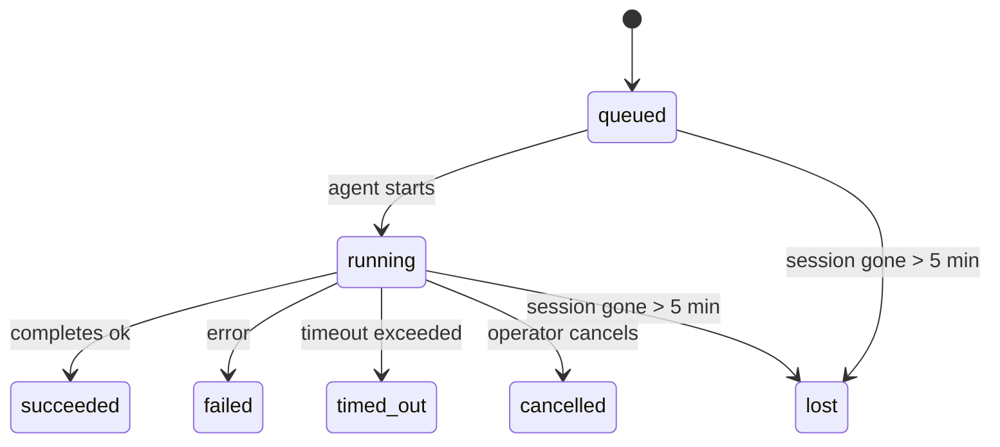

<Note>
Looking for scheduling? See [Automation](/automation) for choosing the right mechanism. This page is the activity ledger for background work, not the scheduler.
</Note>

Background tasks track work that runs **outside your main conversation session**: ACP runs, subagent spawns, isolated cron job executions, and CLI-initiated operations.

Tasks do **not** replace sessions, cron jobs, or heartbeats - they are the **activity ledger** that records what detached work happened, when, and whether it succeeded.

<Note>
Not every agent run creates a task. Heartbeat turns and normal interactive chat do not. All cron executions, ACP spawns, subagent spawns, and CLI agent commands do.
</Note>

## TL;DR

- Tasks are **records**, not schedulers - cron and heartbeat decide _when_ work runs, tasks track _what happened_.
- ACP, subagents, all cron jobs, and CLI operations create tasks. Heartbeat turns do not.
- Each task moves through `queued → running → terminal` (succeeded, failed, timed_out, cancelled, or lost).
- Cron tasks stay live while the cron runtime still owns the job; if the
  in-memory runtime state is gone, task maintenance first checks durable cron
  run history before marking a task lost.
- Completion is push-driven: detached work can notify directly or wake the
  requester session/heartbeat when it finishes, so status polling loops are
  usually the wrong shape.
- Isolated cron runs and subagent completions best-effort clean up tracked browser tabs/processes for their child session before final cleanup bookkeeping.
- Isolated cron delivery suppresses stale interim parent replies while descendant subagent work is still draining, and it prefers final descendant output when that arrives before delivery.
- Completion notifications are delivered directly to a channel or queued for the next heartbeat.
- `autopus tasks list` shows all tasks; `autopus tasks audit` surfaces issues.
- Terminal records are kept for 7 days, then automatically pruned.

## Quick start

<Tabs>
  <Tab title="List and filter">
    ```bash
    # List all tasks (newest first)
    autopus tasks list

    # Filter by runtime or status
    autopus tasks list --runtime acp
    autopus tasks list --status running
    ```

  </Tab>
  <Tab title="Inspect">
    ```bash
    # Show details for a specific task (by ID, run ID, or session key)
    autopus tasks show <lookup>
    ```
  </Tab>
  <Tab title="Cancel and notify">
    ```bash
    # Cancel a running task (kills the child session)
    autopus tasks cancel <lookup>

    # Change notification policy for a task
    autopus tasks notify <lookup> state_changes
    ```

  </Tab>
  <Tab title="Audit and maintenance">
    ```bash
    # Run a health audit
    autopus tasks audit

    # Preview or apply maintenance
    autopus tasks maintenance
    autopus tasks maintenance --apply
    ```

  </Tab>
  <Tab title="Task flow">
    ```bash
    # Inspect TaskFlow state
    autopus tasks flow list
    autopus tasks flow show <lookup>
    autopus tasks flow cancel <lookup>
    ```
  </Tab>
</Tabs>

## What creates a task

| Source                 | Runtime type | When a task record is created                         | Default notify policy |
| ---------------------- | ------------ | ----------------------------------------------------- | --------------------- |
| ACP background runs    | `acp`        | Spawning a child ACP session                          | `done_only`           |
| Subagent orchestration | `subagent`   | Spawning a subagent via `sessions_spawn`              | `done_only`           |
| Cron jobs (all types)  | `cron`       | Every cron execution (main-session and isolated)      | `silent`              |
| CLI operations         | `cli`        | `autopus agent` commands that run through the gateway | `silent`              |
| Agent media jobs       | `cli`        | Session-backed `music_generate`/`video_generate` runs | `silent`              |

<AccordionGroup>
  <Accordion title="Notify defaults for cron and media">
    Main-session cron tasks use `silent` notify policy by default - they create records for tracking but do not generate notifications. Isolated cron tasks also default to `silent` but are more visible because they run in their own session.

    Session-backed `music_generate` and `video_generate` runs also use `silent` notify policy. They still create task records, but completion is handed back to the original agent session as an internal wake so the agent can write the follow-up message and attach the finished media itself. Group/channel completions follow the normal visible-reply policy, so the agent uses the message tool when source delivery requires it. If the completion agent fails to produce message-tool delivery evidence in a tool-only route, Autopus sends the completion fallback directly to the original channel instead of leaving the media private.

  </Accordion>
  <Accordion title="Concurrent video_generate guardrail">
    While a session-backed `video_generate` task is still active, the tool also acts as a guardrail: repeated `video_generate` calls in that same session return the active task status instead of starting a second concurrent generation. Use `action: "status"` when you want an explicit progress/status lookup from the agent side.
  </Accordion>
  <Accordion title="What does not create tasks">
    - Heartbeat turns - main-session; see [Heartbeat](/gateway/heartbeat)
    - Normal interactive chat turns
    - Direct `/command` responses

  </Accordion>
</AccordionGroup>

## Task lifecycle



| Status      | What it means                                                              |
| ----------- | -------------------------------------------------------------------------- |
| `queued`    | Created, waiting for the agent to start                                    |
| `running`   | Agent turn is actively executing                                           |
| `succeeded` | Completed successfully                                                     |
| `failed`    | Completed with an error                                                    |
| `timed_out` | Exceeded the configured timeout                                            |
| `cancelled` | Stopped by the operator via `autopus tasks cancel`                         |
| `lost`      | The runtime lost authoritative backing state after a 5-minute grace period |

Transitions happen automatically - when the associated agent run ends, the task status updates to match.

Agent run completion is authoritative for active task records. A successful detached run finalizes as `succeeded`, ordinary run errors finalize as `failed`, and timeout or abort outcomes finalize as `timed_out`. If an operator already cancelled the task, or the runtime already recorded a stronger terminal state such as `failed`, `timed_out`, or `lost`, a later success signal does not downgrade that terminal status.

`lost` is runtime-aware:

- ACP tasks: backing ACP child session metadata disappeared.
- Subagent tasks: backing child session disappeared from the target agent store.
- Cron tasks: the cron runtime no longer tracks the job as active and durable
  cron run history does not show a terminal result for that run. Offline CLI
  audit does not treat its own empty in-process cron runtime state as authority.
- CLI tasks: tasks with a run id/source id use the live run context, so
  lingering child-session or chat-session rows do not keep them alive after the
  gateway-owned run disappears. Legacy CLI tasks without run identity still fall
  back to the child session. Gateway-backed `autopus agent` runs also finalize
  from their run result, so completed runs do not sit active until the sweeper
  marks them `lost`.

## Delivery and notifications

When a task reaches a terminal state, Autopus notifies you. There are two delivery paths:

**Direct delivery** - if the task has a channel target (the `requesterOrigin`), the completion message goes straight to that channel (Telegram, Discord, Slack, etc.). Group and channel task completions are instead routed through the requester session so the parent agent can write the visible reply. For subagent completions, Autopus also preserves bound thread/topic routing when available and can fill a missing `to` / account from the requester session's stored route (`lastChannel` / `lastTo` / `lastAccountId`) before giving up on direct delivery.

**Session-queued delivery** - if direct delivery fails or no origin is set, the update is queued as a system event in the requester's session and surfaces on the next heartbeat.

<Tip>
Task completion triggers an immediate heartbeat wake so you see the result quickly - you do not have to wait for the next scheduled heartbeat tick.
</Tip>

That means the usual workflow is push-based: start detached work once, then let the runtime wake or notify you on completion. Poll task state only when you need debugging, intervention, or an explicit audit.

### Notification policies

Control how much you hear about each task:

| Policy                | What is delivered                                                       |
| --------------------- | ----------------------------------------------------------------------- |
| `done_only` (default) | Only terminal state (succeeded, failed, etc.) - **this is the default** |
| `state_changes`       | Every state transition and progress update                              |
| `silent`              | Nothing at all                                                          |

Change the policy while a task is running:

```bash
autopus tasks notify <lookup> state_changes
```

## CLI reference

<AccordionGroup>
  <Accordion title="tasks list">
    ```bash
    autopus tasks list [--runtime <acp|subagent|cron|cli>] [--status <status>] [--json]
    ```

    Output columns: Task ID, Kind, Status, Delivery, Run ID, Child Session, Summary.

  </Accordion>
  <Accordion title="tasks show">
    ```bash
    autopus tasks show <lookup>
    ```

    The lookup token accepts a task ID, run ID, or session key. Shows the full record including timing, delivery state, error, and terminal summary.

  </Accordion>
  <Accordion title="tasks cancel">
    ```bash
    autopus tasks cancel <lookup>
    ```

    For ACP and subagent tasks, this kills the child session. For CLI-tracked tasks, cancellation is recorded in the task registry (there is no separate child runtime handle). Status transitions to `cancelled` and a delivery notification is sent when applicable.

  </Accordion>
  <Accordion title="tasks notify">
    ```bash
    autopus tasks notify <lookup> <done_only|state_changes|silent>
    ```
  </Accordion>
  <Accordion title="tasks audit">
    ```bash
    autopus tasks audit [--json]
    ```

    Surfaces operational issues. Findings also appear in `autopus status` when issues are detected.

    | Finding                   | Severity   | Trigger                                                                                                      |
    | ------------------------- | ---------- | ------------------------------------------------------------------------------------------------------------ |
    | `stale_queued`            | warn       | Queued for more than 10 minutes                                                                              |
    | `stale_running`           | error      | Running for more than 30 minutes                                                                             |
    | `lost`                    | warn/error | Runtime-backed task ownership disappeared; retained lost tasks warn until `cleanupAfter`, then become errors |
    | `delivery_failed`         | warn       | Delivery failed and notify policy is not `silent`                                                            |
    | `missing_cleanup`         | warn       | Terminal task with no cleanup timestamp                                                                      |
    | `inconsistent_timestamps` | warn       | Timeline violation (for example ended before started)                                                        |

  </Accordion>
  <Accordion title="tasks maintenance">
    ```bash
    autopus tasks maintenance [--json]
    autopus tasks maintenance --apply [--json]
    ```

    Use this to preview or apply reconciliation, cleanup stamping, and pruning for tasks, Task Flow state, and stale cron run session registry rows.

    Reconciliation is runtime-aware:

    - ACP/subagent tasks check their backing child session.
    - Subagent tasks whose child session has a restart-recovery tombstone are marked lost instead of being treated as recoverable backing sessions.
    - Cron tasks check whether the cron runtime still owns the job, then recover terminal status from persisted cron run logs/job state before falling back to `lost`. Only the Gateway process is authoritative for the in-memory cron active-job set; offline CLI audit uses durable history but does not mark a cron task lost solely because that local Set is empty.
    - CLI tasks with run identity check the owning live run context, not just child-session or chat-session rows.

    Completion cleanup is also runtime-aware:

    - Subagent completion best-effort closes tracked browser tabs/processes for the child session before announce cleanup continues.
    - Isolated cron completion best-effort closes tracked browser tabs/processes for the cron session before the run fully tears down.
    - Isolated cron delivery waits out descendant subagent follow-up when needed and suppresses stale parent acknowledgement text instead of announcing it.
    - Subagent completion delivery prefers the latest visible assistant text; if that is empty it falls back to sanitized latest tool/toolResult text, and timeout-only tool-call runs can collapse to a short partial-progress summary. Terminal failed runs announce failure status without replaying captured reply text.
    - Cleanup failures do not mask the real task outcome.

    When applying maintenance, Autopus also removes stale `cron:<jobId>:run:<uuid>` session registry rows older than 7 days, while preserving rows for currently running cron jobs and leaving non-cron session rows untouched.

  </Accordion>
  <Accordion title="tasks flow list | show | cancel">
    ```bash
    autopus tasks flow list [--status <status>] [--json]
    autopus tasks flow show <lookup> [--json]
    autopus tasks flow cancel <lookup>
    ```

    Use these when the orchestrating Task Flow is the thing you care about rather than one individual background task record.

  </Accordion>
</AccordionGroup>

## Chat task board (`/tasks`)

Use `/tasks` in any chat session to see background tasks linked to that session. The board shows active and recently completed tasks with runtime, status, timing, and progress or error detail.

When the current session has no visible linked tasks, `/tasks` falls back to agent-local task counts so you still get an overview without leaking other-session details.

For the full operator ledger, use the CLI: `autopus tasks list`.

## Status integration (task pressure)

`autopus status` includes an at-a-glance task summary:

```
Tasks: 3 queued · 2 running · 1 issues
```

The summary reports:

- **active** - count of `queued` + `running`
- **failures** - count of `failed` + `timed_out` + `lost`
- **byRuntime** - breakdown by `acp`, `subagent`, `cron`, `cli`

Both `/status` and the `session_status` tool use a cleanup-aware task snapshot: active tasks are preferred, stale completed rows are hidden, and recent failures only surface when no active work remains. This keeps the status card focused on what matters right now.

## Storage and maintenance

### Where tasks live

Task records persist in SQLite at:

```
$AUTOPUS_STATE_DIR/tasks/runs.sqlite
```

The registry loads into memory at gateway start and syncs writes to SQLite for durability across restarts.
The Gateway keeps the SQLite write-ahead log bounded by using SQLite's default
autocheckpoint threshold plus periodic and shutdown `TRUNCATE` checkpoints.

### Automatic maintenance

A sweeper runs every **60 seconds** and handles four things:

<Steps>
  <Step title="Reconciliation">
    Checks whether active tasks still have authoritative runtime backing. ACP/subagent tasks use child-session state, cron tasks use active-job ownership, and CLI tasks with run identity use the owning run context. If that backing state is gone for more than 5 minutes, the task is marked `lost`.
  </Step>
  <Step title="ACP session repair">
    Closes terminal or orphaned parent-owned one-shot ACP sessions, and closes stale terminal or orphaned persistent ACP sessions only when no active conversation binding remains.
  </Step>
  <Step title="Cleanup stamping">
    Sets a `cleanupAfter` timestamp on terminal tasks (endedAt + 7 days). During retention, lost tasks still appear in audit as warnings; after `cleanupAfter` expires or when cleanup metadata is missing, they are errors.
  </Step>
  <Step title="Pruning">
    Deletes records past their `cleanupAfter` date.
  </Step>
</Steps>

<Note>
**Retention:** terminal task records are kept for **7 days**, then automatically pruned. No configuration needed.
</Note>

## How tasks relate to other systems

<AccordionGroup>
  <Accordion title="Tasks and Task Flow">
    [Task Flow](/automation/taskflow) is the flow orchestration layer above background tasks. A single flow may coordinate multiple tasks over its lifetime using managed or mirrored sync modes. Use `autopus tasks` to inspect individual task records and `autopus tasks flow` to inspect the orchestrating flow.

    See [Task Flow](/automation/taskflow) for details.

  </Accordion>
  <Accordion title="Tasks and cron">
    A cron job **definition** lives in `~/.autopus/cron/jobs.json`; runtime execution state lives beside it in `~/.autopus/cron/jobs-state.json`. **Every** cron execution creates a task record - both main-session and isolated. Main-session cron tasks default to `silent` notify policy so they track without generating notifications.

    See [Cron Jobs](/automation/cron-jobs).

  </Accordion>
  <Accordion title="Tasks and heartbeat">
    Heartbeat runs are main-session turns - they do not create task records. When a task completes, it can trigger a heartbeat wake so you see the result promptly.

    See [Heartbeat](/gateway/heartbeat).

  </Accordion>
  <Accordion title="Tasks and sessions">
    A task may reference a `childSessionKey` (where work runs) and a `requesterSessionKey` (who started it). Sessions are conversation context; tasks are activity tracking on top of that.
  </Accordion>
  <Accordion title="Tasks and agent runs">
    A task's `runId` links to the agent run doing the work. Agent lifecycle events (start, end, error) automatically update the task status - you do not need to manage the lifecycle manually.
  </Accordion>
</AccordionGroup>

## Related

- [Automation](/automation) - all automation mechanisms at a glance
- [CLI: Tasks](/cli/tasks) - CLI command reference
- [Heartbeat](/gateway/heartbeat) - periodic main-session turns
- [Scheduled Tasks](/automation/cron-jobs) - scheduling background work
- [Task Flow](/automation/taskflow) - flow orchestration above tasks
