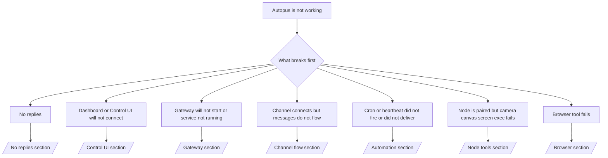

If you only have 2 minutes, use this page as a triage front door.

## First 60 seconds

Run this exact ladder in order:

```bash
autopus status
autopus status --all
autopus gateway probe
autopus gateway status
autopus doctor
autopus channels status --probe
autopus logs --follow
```

Good output in one line:

- `autopus status` → shows configured channels and no obvious auth errors.
- `autopus status --all` → full report is present and shareable.
- `autopus gateway probe` → expected gateway target is reachable (`Reachable: yes`). `Capability: ...` tells you what auth level the probe could prove, and `Read probe: limited - missing scope: operator.read` is degraded diagnostics, not a connect failure.
- `autopus gateway status` → `Runtime: running`, `Connectivity probe: ok`, and a plausible `Capability: ...` line. Use `--require-rpc` if you need read-scope RPC proof too.
- `autopus doctor` → no blocking config/service errors.
- `autopus channels status --probe` → reachable gateway returns live per-account
  transport state plus probe/audit results such as `works` or `audit ok`; if the
  gateway is unreachable, the command falls back to config-only summaries.
- `autopus logs --follow` → steady activity, no repeating fatal errors.

## Anthropic long context 429

If you see:
`HTTP 429: rate_limit_error: Extra usage is required for long context requests`,
go to [/gateway/troubleshooting#anthropic-429-extra-usage-required-for-long-context](/gateway/troubleshooting#anthropic-429-extra-usage-required-for-long-context).

## Local OpenAI-compatible backend works directly but fails in Autopus

If your local or self-hosted `/v1` backend answers small direct
`/v1/chat/completions` probes but fails on `autopus infer model run` or normal
agent turns:

1. If the error mentions `messages[].content` expecting a string, set
   `models.providers.<provider>.models[].compat.requiresStringContent: true`.
2. If the backend still fails only on Autopus agent turns, set
   `models.providers.<provider>.models[].compat.supportsTools: false` and retry.
3. If tiny direct calls still work but larger Autopus prompts crash the
   backend, treat the remaining issue as an upstream model/server limitation and
   continue in the deep runbook:
   [/gateway/troubleshooting#local-openai-compatible-backend-passes-direct-probes-but-agent-runs-fail](/gateway/troubleshooting#local-openai-compatible-backend-passes-direct-probes-but-agent-runs-fail)

## Plugin install fails with missing autopus extensions

If install fails with `package.json missing autopus.extensions`, the plugin package
is using an old shape that Autopus no longer accepts.

Fix in the plugin package:

1. Add `autopus.extensions` to `package.json`.
2. Point entries at built runtime files (usually `./dist/index.js`).
3. Republish the plugin and run `autopus plugins install <package>` again.

Example:

```json
{
  "name": "@autopus/my-plugin",
  "version": "1.2.3",
  "autopus": {
    "extensions": ["./dist/index.js"]
  }
}
```

Reference: [Plugin architecture](/plugins/architecture)

## Plugin present but blocked by suspicious ownership

If `autopus doctor`, setup, or startup warnings show:

```text
blocked plugin candidate: suspicious ownership (... uid=1000, expected uid=0 or root)
plugin present but blocked
```

the plugin files are owned by a different Unix user than the process loading
them. Do not remove the plugin config. Fix the file ownership or run Autopus as
the same user that owns the state directory.

Docker installs normally run as `node` (uid `1000`). For the default Docker
setup, repair the host bind mounts:

```bash
sudo chown -R 1000:1000 /path/to/autopus-config /path/to/autopus-workspace
autopus doctor --fix
```

If you intentionally run Autopus as root, repair the managed plugin root to
root ownership instead:

```bash
sudo chown -R root:root /path/to/autopus-config/npm
autopus doctor --fix
```

Deeper docs:

- [Plugin path ownership](/tools/plugin#blocked-plugin-path-ownership)
- [Docker permissions](/install/docker#permissions-and-eacces)

## Decision tree



<AccordionGroup>
  <Accordion title="No replies">
    ```bash
    autopus status
    autopus gateway status
    autopus channels status --probe
    autopus pairing list --channel <channel> [--account <id>]
    autopus logs --follow
    ```

    Good output looks like:

    - `Runtime: running`
    - `Connectivity probe: ok`
    - `Capability: read-only`, `write-capable`, or `admin-capable`
    - Your channel shows transport connected and, where supported, `works` or `audit ok` in `channels status --probe`
    - Sender appears approved (or DM policy is open/allowlist)

    Common log signatures:

    - `drop guild message (mention required` → mention gating blocked the message in Discord.
    - `pairing request` → sender is unapproved and waiting for DM pairing approval.
    - `blocked` / `allowlist` in channel logs → sender, room, or group is filtered.

    Deep pages:

    - [/gateway/troubleshooting#no-replies](/gateway/troubleshooting#no-replies)
    - [/channels/troubleshooting](/channels/troubleshooting)
    - [/channels/pairing](/channels/pairing)

  </Accordion>

  <Accordion title="Dashboard or Control UI will not connect">
    ```bash
    autopus status
    autopus gateway status
    autopus logs --follow
    autopus doctor
    autopus channels status --probe
    ```

    Good output looks like:

    - `Dashboard: http://...` is shown in `autopus gateway status`
    - `Connectivity probe: ok`
    - `Capability: read-only`, `write-capable`, or `admin-capable`
    - No auth loop in logs

    Common log signatures:

    - `device identity required` → HTTP/non-secure context cannot complete device auth.
    - `origin not allowed` → browser `Origin` is not allowed for the Control UI
      gateway target.
    - `AUTH_TOKEN_MISMATCH` with retry hints (`canRetryWithDeviceToken=true`) → one trusted device-token retry may occur automatically.
    - That cached-token retry reuses the cached scope set stored with the paired
      device token. Explicit `deviceToken` / explicit `scopes` callers keep
      their requested scope set instead.
    - On the async Tailscale Serve Control UI path, failed attempts for the same
      `{scope, ip}` are serialized before the limiter records the failure, so a
      second concurrent bad retry can already show `retry later`.
    - `too many failed authentication attempts (retry later)` from a localhost
      browser origin → repeated failures from that same `Origin` are temporarily
      locked out; another localhost origin uses a separate bucket.
    - repeated `unauthorized` after that retry → wrong token/password, auth mode mismatch, or stale paired device token.
    - `gateway connect failed:` → UI is targeting the wrong URL/port or unreachable gateway.

    Deep pages:

    - [/gateway/troubleshooting#dashboard-control-ui-connectivity](/gateway/troubleshooting#dashboard-control-ui-connectivity)
    - [/web/control-ui](/web/control-ui)
    - [/gateway/authentication](/gateway/authentication)

  </Accordion>

  <Accordion title="Gateway will not start or service installed but not running">
    ```bash
    autopus status
    autopus gateway status
    autopus logs --follow
    autopus doctor
    autopus channels status --probe
    ```

    Good output looks like:

    - `Service: ... (loaded)`
    - `Runtime: running`
    - `Connectivity probe: ok`
    - `Capability: read-only`, `write-capable`, or `admin-capable`

    Common log signatures:

    - `Gateway start blocked: set gateway.mode=local` or `existing config is missing gateway.mode` → gateway mode is remote, or the config file is missing the local-mode stamp and should be repaired.
    - `refusing to bind gateway ... without auth` → non-loopback bind without a valid gateway auth path (token/password, or trusted-proxy where configured).
    - `another gateway instance is already listening` or `EADDRINUSE` → port already taken.

    Deep pages:

    - [/gateway/troubleshooting#gateway-service-not-running](/gateway/troubleshooting#gateway-service-not-running)
    - [/gateway/background-process](/gateway/background-process)
    - [/gateway/configuration](/gateway/configuration)

  </Accordion>

  <Accordion title="Channel connects but messages do not flow">
    ```bash
    autopus status
    autopus gateway status
    autopus logs --follow
    autopus doctor
    autopus channels status --probe
    ```

    Good output looks like:

    - Channel transport is connected.
    - Pairing/allowlist checks pass.
    - Mentions are detected where required.

    Common log signatures:

    - `mention required` → group mention gating blocked processing.
    - `pairing` / `pending` → DM sender is not approved yet.
    - `not_in_channel`, `missing_scope`, `Forbidden`, `401/403` → channel permission token issue.

    Deep pages:

    - [/gateway/troubleshooting#channel-connected-messages-not-flowing](/gateway/troubleshooting#channel-connected-messages-not-flowing)
    - [/channels/troubleshooting](/channels/troubleshooting)

  </Accordion>

  <Accordion title="Cron or heartbeat did not fire or did not deliver">
    ```bash
    autopus status
    autopus gateway status
    autopus cron status
    autopus cron list
    autopus cron runs --id <jobId> --limit 20
    autopus logs --follow
    ```

    Good output looks like:

    - `cron.status` shows enabled with a next wake.
    - `cron runs` shows recent `ok` entries.
    - Heartbeat is enabled and not outside active hours.

    Common log signatures:

    - `cron: scheduler disabled; jobs will not run automatically` → cron is disabled.
    - `heartbeat skipped` with `reason=quiet-hours` → outside configured active hours.
    - `heartbeat skipped` with `reason=empty-heartbeat-file` → `HEARTBEAT.md` exists but only contains blank/header-only scaffolding.
    - `heartbeat skipped` with `reason=no-tasks-due` → `HEARTBEAT.md` task mode is active but none of the task intervals are due yet.
    - `heartbeat skipped` with `reason=alerts-disabled` → all heartbeat visibility is disabled (`showOk`, `showAlerts`, and `useIndicator` are all off).
    - `requests-in-flight` → main lane busy; heartbeat wake was deferred.
    - `unknown accountId` → heartbeat delivery target account does not exist.

    Deep pages:

    - [/gateway/troubleshooting#cron-and-heartbeat-delivery](/gateway/troubleshooting#cron-and-heartbeat-delivery)
    - [/automation/cron-jobs#troubleshooting](/automation/cron-jobs#troubleshooting)
    - [/gateway/heartbeat](/gateway/heartbeat)

  </Accordion>

  <Accordion title="Node is paired but tool fails camera canvas screen exec">
    ```bash
    autopus status
    autopus gateway status
    autopus nodes status
    autopus nodes describe --node <idOrNameOrIp>
    autopus logs --follow
    ```

    Good output looks like:

    - Node is listed as connected and paired for role `node`.
    - Capability exists for the command you are invoking.
    - Permission state is granted for the tool.

    Common log signatures:

    - `NODE_BACKGROUND_UNAVAILABLE` → bring node app to foreground.
    - `*_PERMISSION_REQUIRED` → OS permission was denied/missing.
    - `SYSTEM_RUN_DENIED: approval required` → exec approval is pending.
    - `SYSTEM_RUN_DENIED: allowlist miss` → command not on exec allowlist.

    Deep pages:

    - [/gateway/troubleshooting#node-paired-tool-fails](/gateway/troubleshooting#node-paired-tool-fails)
    - [/nodes/troubleshooting](/nodes/troubleshooting)
    - [/tools/exec-approvals](/tools/exec-approvals)

  </Accordion>

  <Accordion title="Exec suddenly asks for approval">
    ```bash
    autopus config get tools.exec.host
    autopus config get tools.exec.security
    autopus config get tools.exec.ask
    autopus gateway restart
    ```

    What changed:

    - If `tools.exec.host` is unset, the default is `auto`.
    - `host=auto` resolves to `sandbox` when a sandbox runtime is active, `gateway` otherwise.
    - `host=auto` is routing only; the no-prompt "YOLO" behavior comes from `security=full` plus `ask=off` on gateway/node.
    - On `gateway` and `node`, unset `tools.exec.security` defaults to `full`.
    - Unset `tools.exec.ask` defaults to `off`.
    - Result: if you are seeing approvals, some host-local or per-session policy tightened exec away from the current defaults.

    Restore current default no-approval behavior:

    ```bash
    autopus config set tools.exec.host gateway
    autopus config set tools.exec.security full
    autopus config set tools.exec.ask off
    autopus gateway restart
    ```

    Safer alternatives:

    - Set only `tools.exec.host=gateway` if you just want stable host routing.
    - Use `security=allowlist` with `ask=on-miss` if you want host exec but still want review on allowlist misses.
    - Enable sandbox mode if you want `host=auto` to resolve back to `sandbox`.

    Common log signatures:

    - `Approval required.` → command is waiting on `/approve ...`.
    - `SYSTEM_RUN_DENIED: approval required` → node-host exec approval is pending.
    - `exec host=sandbox requires a sandbox runtime for this session` → implicit/explicit sandbox selection but sandbox mode is off.

    Deep pages:

    - [/tools/exec](/tools/exec)
    - [/tools/exec-approvals](/tools/exec-approvals)
    - [/gateway/security#what-the-audit-checks-high-level](/gateway/security#what-the-audit-checks-high-level)

  </Accordion>

  <Accordion title="Browser tool fails">
    ```bash
    autopus status
    autopus gateway status
    autopus browser status
    autopus logs --follow
    autopus doctor
    ```

    Good output looks like:

    - Browser status shows `running: true` and a chosen browser/profile.
    - `autopus` starts, or `user` can see local Chrome tabs.

    Common log signatures:

    - `unknown command "browser"` or `unknown command 'browser'` → `plugins.allow` is set and does not include `browser`.
    - `Failed to start Chrome CDP on port` → local browser launch failed.
    - `browser.executablePath not found` → configured binary path is wrong.
    - `browser.cdpUrl must be http(s) or ws(s)` → the configured CDP URL uses an unsupported scheme.
    - `browser.cdpUrl has invalid port` → the configured CDP URL has a bad or out-of-range port.
    - `No Chrome tabs found for profile="user"` → the Chrome MCP attach profile has no open local Chrome tabs.
    - `Remote CDP for profile "<name>" is not reachable` → the configured remote CDP endpoint is not reachable from this host.
    - `Browser attachOnly is enabled ... not reachable` or `Browser attachOnly is enabled and CDP websocket ... is not reachable` → attach-only profile has no live CDP target.
    - stale viewport / dark-mode / locale / offline overrides on attach-only or remote CDP profiles → run `autopus browser stop --browser-profile <name>` to close the active control session and release emulation state without restarting the gateway.

    Deep pages:

    - [/gateway/troubleshooting#browser-tool-fails](/gateway/troubleshooting#browser-tool-fails)
    - [/tools/browser#missing-browser-command-or-tool](/tools/browser#missing-browser-command-or-tool)
    - [/tools/browser-linux-troubleshooting](/tools/browser-linux-troubleshooting)
    - [/tools/browser-wsl2-windows-remote-cdp-troubleshooting](/tools/browser-wsl2-windows-remote-cdp-troubleshooting)

  </Accordion>

</AccordionGroup>

## Related

- [FAQ](/help/faq) — frequently asked questions
- [Gateway Troubleshooting](/gateway/troubleshooting) — gateway-specific issues
- [Doctor](/gateway/doctor) — automated health checks and repairs
- [Channel Troubleshooting](/channels/troubleshooting) — channel connectivity issues
- [Automation Troubleshooting](/automation/cron-jobs#troubleshooting) — cron and heartbeat issues
